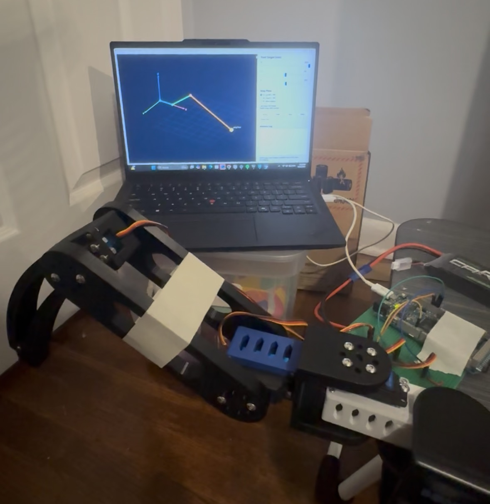
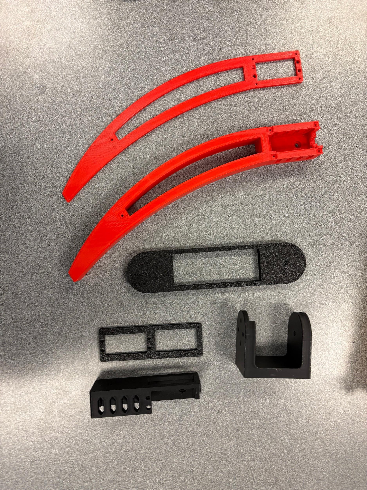
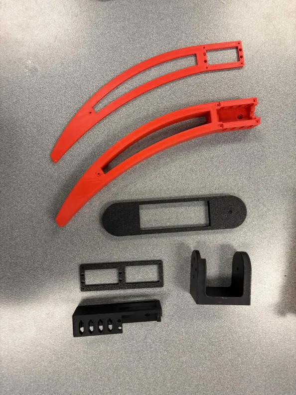

# Logan's Little Spider Project - Single-Leg Controller

Code for controlling and testing one three-servo leg of a custom hexapod robot.
The Arduino handles inverse kinematics and servo motion. The Python tools provide
a draggable 3D controller and a simpler command dashboard.

## Prototype







## Repository layout

- `code/` - Arduino firmware, joint calibration sketch, and Python controllers
- `assets/bom.csv` - parts used in the working single-leg prototype
- `assets/cad/` - STL exports for the individual parts, servo reference, and full model

## Run the controller

Upload `code/leg_prototype/leg_prototype.ino` in Arduino IDE. The servo signal
pins are coxa `8`, femur `9`, and tibia `10`. Power the servos from a separate
supply and connect its ground to Arduino ground.

Install the Python serial dependency and run the 3D controller, replacing
`COM5` with the Arduino port:

```powershell
python -m pip install pyserial
python .\code\leg_controller.py --port COM5
```

Run the visualizer without hardware:

```powershell
python .\code\leg_controller.py --simulate
```

Open the simpler command dashboard with:

```powershell
python .\code\command_dashboard.py --port COM5
```

For unloaded, joint-by-joint calibration, upload
`code/joint_servo_test/joint_servo_test.ino` first. Use `CENTER`, `TEST COXA`,
`TEST FEMUR`, `TEST TIBIA`, and `RAW <joint> <angle>` from Serial Monitor at
`115200` baud.
